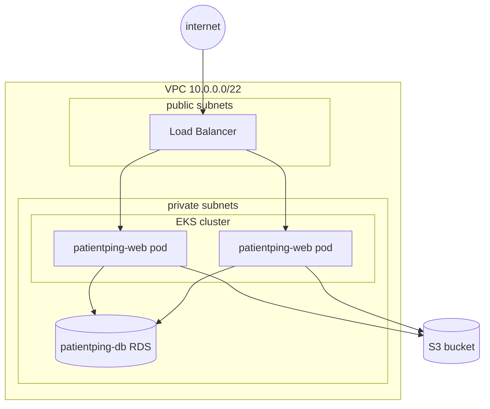

# AWS - EKS - Elastic Kubernetes Service

- 001 - [eks-cluster](eks-cluster/) = cluster kurulumu (control plane + worker node'lar)
- 002 - [eks-vs-kubeadm](eks-vs-kubeadm/) = kendi kubeadm cluster'ınla farklar
- 003 - [eks-deploy-app](eks-deploy-app/) = uygulamayı EKS'e deploy etme
- 004 - [eks-connect-s3](eks-connect-s3/) = S3'e bağlama (IRSA ile pod bazlı IAM)
- 005 - [eks-use-rds](eks-use-rds/) = RDS'i kullanma (Secret + security group)
- 006 - [eks-node-affinity-taints](eks-node-affinity-taints/) = node affinity + taints EKS'te nasıl çalışır
- 007 - [eks-ha-cluster](eks-ha-cluster/) = HA: control plane AWS'te, worker katmanı sende
- 008 - [eks-spot-instances](eks-spot-instances/) = spot node group + stateless app (ucuz cattle)

[EKS](https://aws.amazon.com/eks/) (**Elastic Kubernetes Service**) is AWS' _managed_ Kubernetes offering. If you've been through my [Kubernetes](../../kubernetes/) notes with Minikube, this is the production version of the same thing: the **control plane** (API server, etcd, scheduler) is run and patched by AWS, and you manage the **worker nodes** (or let Fargate run pods without nodes at all).

You already know why we might want [ECS](../ecs/why-ecs/) instead: it trades flexibility for simplicity. But if you want the full Kubernetes API - `Deployment`, `Service`, `Ingress`, `Helm`, operators, and everything else - EKS is how you get it without babysitting etcd.

In this section we take the PatientPing app from the earlier lessons and run it on EKS:

1. We create a cluster in our VPC.
2. We compare it with my own [kubeadm cluster](../../../kubernetes_v2/multi-node-kubeadm/) - what AWS takes, what stays the same.
3. We deploy `patientping-web` to it.
4. We let the pods talk to S3 (for the favicon and other files).
5. We let the pods talk to our RDS Postgres database.
6. We look at scheduling on managed node groups: taints and node affinity.
7. We make the whole thing survive losing a node - EKS-style HA.
8. We run the stateless app on interruptible, ~90% cheaper spot capacity.

## Architecture

> Not: EKS cluster'ı VPC'mizin private subnet'lerinde durur, dışarıdan trafik Load Balancer üzerinden gelir. RDS zaten private subnet'te - pod'larla aynı VPC içinde oldukları için yerel rota üzerinden konuşurlar.

**Cost check:** EKS isn't free-tier friendly. The control plane alone costs about **$0.10 per hour** (~$73/month) whether or not you run any pods, _plus_ the EC2 instances (or Fargate vCPUs) for your worker nodes. **Delete the cluster when you're done with this section.**
