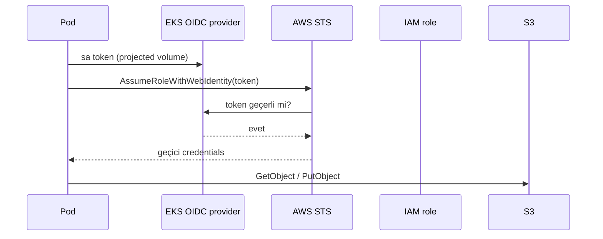

# Connect S3 to EKS

The PatientPing app serves a favicon and will store user uploads in S3. Our pods need to call the S3 API — but how do they get AWS credentials?

The lazy way is to bake an access key into the container image or paste it into a `Deployment` env var. **Don't.** Long-lived keys in a pod spec end up in git, in `kubectl describe` output, and in your terminal history. And giving the **worker nodes** a broad S3 role is also wrong: any pod on the node (including one you didn't write) inherits it.

The right tool is [**IRSA**](https://docs.aws.amazon.com/eks/latest/userguide/iam-roles-for-service-accounts.html) (**IAM Roles for Service Accounts**). It ties an IAM role to a Kubernetes `ServiceAccount`:

1. The EKS control plane runs an **OIDC identity provider** for your cluster.
2. You create an IAM role whose trust policy says "only this cluster's `ServiceAccount` named X may assume me".
3. The pods using that `ServiceAccount` get short-lived credentials via the [STS](https://docs.aws.amazon.com/STS/latest/APIReference/welcome.html) `AssumeRoleWithWebIdentity` API — no keys stored anywhere.



## Assignment

**Give the `patientping-web` pods read/write access to the `patientping-favicon-bucket` S3 bucket using IRSA.**

**Cost check:** IAM roles, service accounts, and STS calls are all free. S3 itself costs a fraction of a penny for a favicon-sized object.

1.  Create an IAM policy that allows access to only our bucket (least privilege — not `s3:*` on `*`):

```bash
aws iam create-policy \
  --policy-name patientping-s3-access \
  --policy-document '{
    "Version": "2012-10-17",
    "Statement": [{
      "Effect": "Allow",
      "Action": ["s3:GetObject", "s3:PutObject", "s3:ListBucket"],
      "Resource": [
        "arn:aws:s3:::patientping-favicon-bucket",
        "arn:aws:s3:::patientping-favicon-bucket/*"
      ]
    }]
  }'
```

2.  Use `eksctl` to create the IAM role and wire it to a `ServiceAccount` in one step (it handles the OIDC trust policy for us):

```bash
eksctl create iamserviceaccount \
  --cluster patientping-eks \
  --namespace default \
  --name patientping-sa \
  --attach-policy-arn arn:aws:iam::ACCOUNT_ID:policy/patientping-s3-access \
  --approve
```

3.  Point the deployment at that service account. In `patientping-web.yaml`, under `spec.template.spec`, add:

```yaml
      serviceAccountName: patientping-sa
```

Then re-apply:

```bash
kubectl apply -f patientping-web.yaml
```

4.  Verify from inside a pod that credentials work:

```bash
kubectl exec deploy/patientping-web -- \
  aws s3 ls s3://patientping-favicon-bucket/
```

> If `aws` isn't installed in the container, any S3 API call your app makes is the real test — load the app in a browser and check the favicon appears.

**That's it — pods now have scoped, short-lived S3 access.** No keys in images, no node-wide role, and you can revoke everything by deleting one IAM role.

> Not: `eksctl create iamserviceaccount` ServiceAccount'a `eks.amazonaws.com/role-arn` annotation'ı ekler. Pod başladığında AWS SDK bu annotation'ı görür ve token'ı STS'e yollar. Eski pod'ları `kubectl rollout restart deployment patientping-web` ile yeniden başlatmayı unutmayın.
