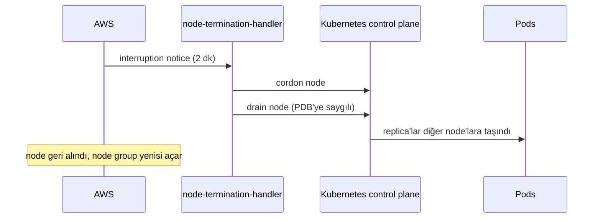

# Spot Instances on EKS

You already know [spot instances](../../general-knowledge/spot-instances/) from the EC2 lessons: unused AWS capacity at a **~90% discount**, with one small caveat — "at any time I may literally delete your server" with a **2-minute heads-up**.

EKS doesn't change the deal; it just changes how you consume it. Instead of bidding on individual instances, you declare one line in a managed node group and Kubernetes schedules onto the cheap cattle:

```yaml
capacityType: SPOT
```

## Why this pairs perfectly with stateless apps

From the [cattle-not-pets](../../general-knowledge/auto-scaling-groups/) notes: a **stateless** app stores no critical data on its compute nodes — the data lives in a stateful database (RDS), and the HTTP servers can be destroyed and replaced at will. A spot interruption is exactly that: the node vanishes, the pods are rescheduled somewhere else, and the app never knew it had a "server".

`patientping-web` is the textbook case: stateless HTTP/REST, state in [RDS](../eks-use-rds/), files in [S3](../eks-connect-s3/). If a spot node gets reclaimed, `Deployment` recreates the pods on the survivors.

> Spot + stateless = cattle'ın en ucuz hali. Ama dikkat: local disk'e yazan, sticky session tutan ya da "asla ölmemeli" diyen işler spot'a girmez. O işler zaten stateful ve [RDS](../../general-knowledge/auto-scaling-groups/) gibi yönetilen servislere ait.

## The spot node group

```yaml
managedNodeGroups:
  - name: patientping-spot
    capacityType: SPOT
    instanceTypes: [t3.small, t3a.small, t2.small, t3.medium]
    desiredCapacity: 2
    privateNetworking: true
    labels:
      capacity: spot
    taints:
      - key: capacity
        value: spot
        effect: NoSchedule
```

Two details matter more than the `capacityType` line:

- **Instance diversification.** Spot capacity is a pool per instance type per AZ. Listing several types (`t3`/`t3a`/`t2` family) lets AWS draw from the deepest pools — fewer interruptions, better prices. A single instance type is a single pool: when it dries up, your nodes go away.
- **Taint + label** — the same mechanism from [eks-node-affinity-taints](../eks-node-affinity-taints/). The taint keeps everything that doesn't explicitly opt in off the interruptible nodes; the label lets opted-in pods say "yes, here please".

## Handling the 2-minute warning

When AWS reclaims capacity it sends an interruption notice. The [aws-node-termination-handler](https://github.com/aws/aws-node-termination-handler) DaemonSet watches for those notices and:

1. **Cordons** the node (no new pods land there),
2. **Drains** it (respecting our [PDB](../eks-ha-cluster/), so only `minAvailable` replicas go down),
3. Updates the ASG/instance lifecycle so a replacement can launch.



Without the handler, you get the vanilla Kubernetes experience: nodes flip to `NotReady` after they die and pods just sit `Terminating` until the grace period expires. With it, the evacuation starts _before_ the eviction.

## Mixed mode (optional but honest)

If the app needs to stay up even through a bad spot week, run **both** node groups — a small on-demand group for the guaranteed floor and a spot group for cheap extra capacity. Same taints idea: mark each group, and use `preferredDuringScheduling` node affinity to say "prefer spot, fall back to on-demand".

> Fargate'te spot yok. Fargate sadece on-demand fiyatıyla çalışır — spot istiyorsanız EC2 tabanlı node group'lar şart. Karpenter spot için daha modern bir alternatif (interruption handling içinde gelir) ama managed node group + NTH ikilisi çoğu iş için fazlasıyla yeterli.

## Assignment

**Give the stateless `patientping-web` app its own cheap, interruptible node group — and watch it survive a node going away.**

**Cost check:** A `t3.small` on-demand is about **$0.02/hour**; the same on spot is typically **$0.005-0.007/hour** — roughly 60-70% off. Two nodes for a day costs a couple of cents. Still: **delete the spot group when you're done** (`eksctl delete nodegroup --cluster patientping-eks --name patientping-spot`).

1.  Add the `patientping-spot` group to `patientping-eks.yaml` and create it:

```bash
eksctl create nodegroup --cluster patientping-eks -f patientping-eks.yaml
```

2.  Install the termination handler:

```bash
helm repo add aws https://aws.github.io/eks-charts
helm install nth aws/aws-node-termination-handler \
  --namespace kube-system --set enableSpotInterruptionDraining=true
```

3.  Pin the app to spot capacity. In the `patientping-web` Deployment's pod spec:

```yaml
      tolerations:
        - key: capacity
          operator: Equal
          value: spot
          effect: NoSchedule
      affinity:
        nodeAffinity:
          preferredDuringSchedulingIgnoredDuringExecution:
            - weight: 100
              preference:
                matchExpressions:
                  - key: capacity
                    operator: In
                    values: ["spot"]
```

```bash
kubectl apply -f patientping-web.yaml
kubectl rollout restart deployment patientping-web
```

4.  Verify placement:

```bash
kubectl get pods -o wide
kubectl get nodes -l capacity=spot
```

Both replicas should now show a `patientping-spot` node in the `NODE` column.

5.  (Chaos, optional) Kill one spot node the way AWS would — terminate its instance in the console — and watch the recovery:

```bash
kubectl get pods -w
```

The pods on the dead node are recreated on the surviving node(s), the PDB keeps at least one replica serving, and the node group launches a replacement. That is the entire promise of spot: **cattle that is 90% cheaper to feed.**
